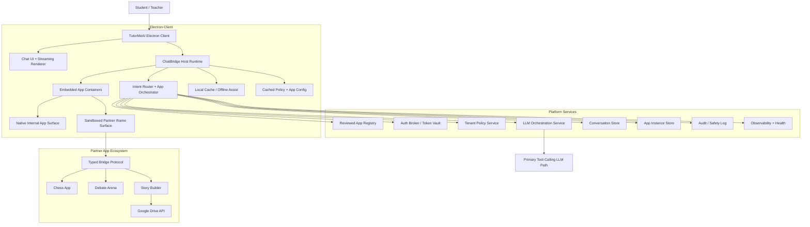
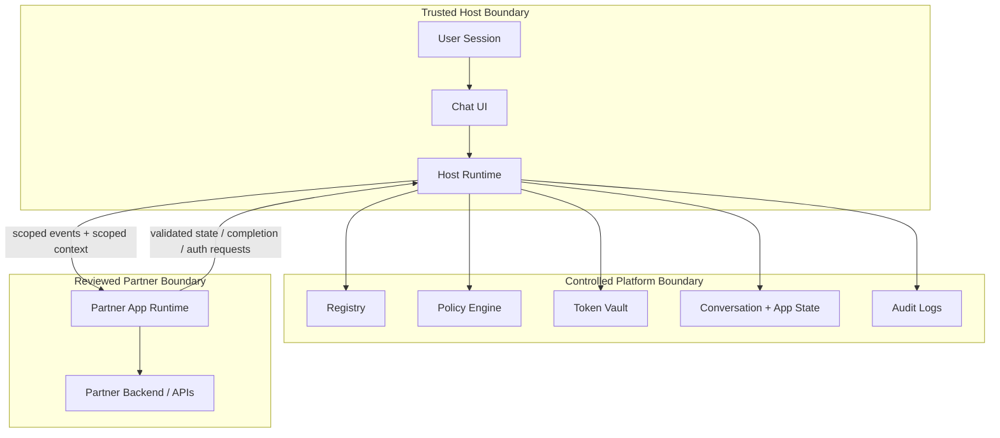
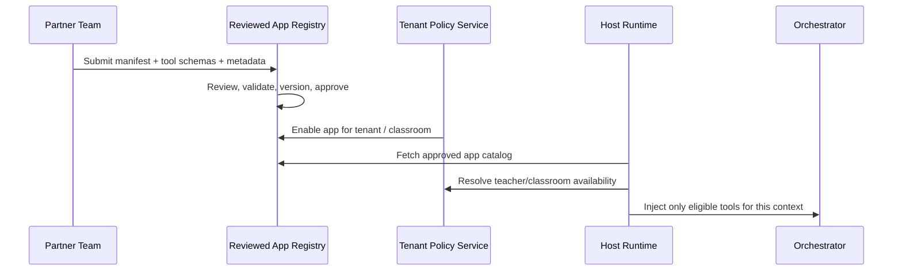
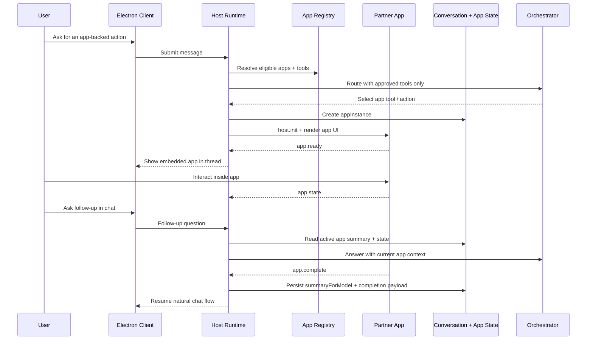
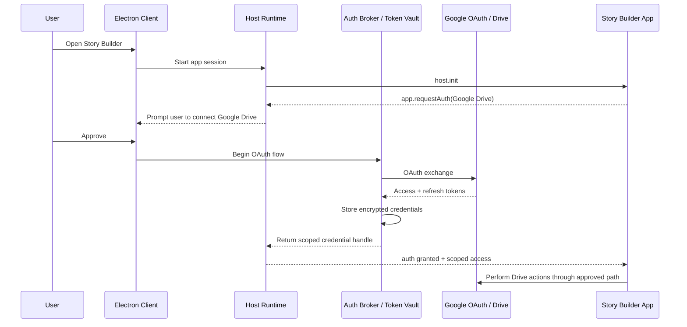
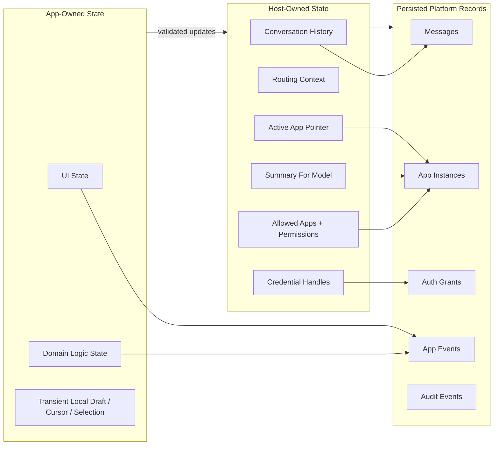
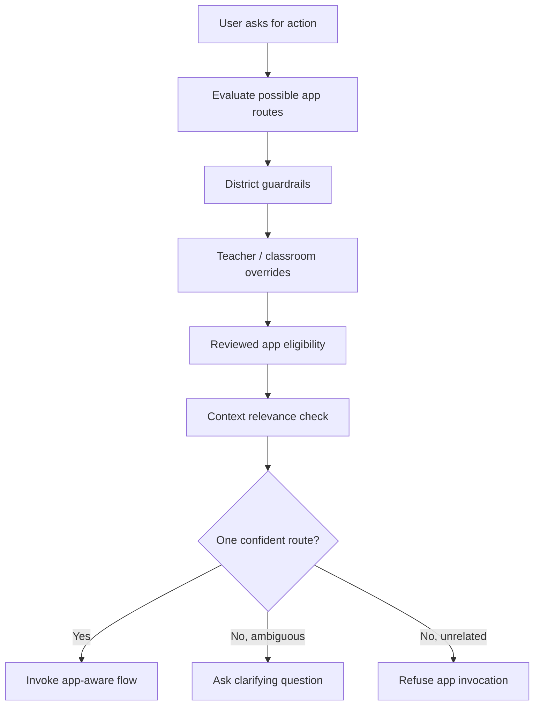

# ChatBridge Technical Architecture

This document is the technical companion to [PRESEARCH.md](./PRESEARCH.md). It is presentation-friendly by design and focuses on the runtime, trust boundaries, state ownership model, and the critical lifecycle that makes third-party applications feel native inside chat.

## 1. Architecture Goals

ChatBridge needs to satisfy four architectural goals at the same time:

- Keep the chat experience continuous while apps appear, update, and complete inside the thread.
- Preserve TutorMeAI's trust model for K-12 through reviewed partners, scoped permissions, and teacher-governed access.
- Support different classes of apps, including no-auth, public external, and authenticated partner experiences.
- Stay Electron-first so the existing repo remains the main client shell rather than becoming a throwaway prototype.

## 2. System Overview

### Why this shape

- The Electron client stays in charge of the user experience.
- The host runtime becomes the policy and lifecycle brain of the app platform.
- Platform services own the parts that must be centralized: registry, policy, auth, persistence, auditability, and health.
- Partner apps remain isolated from both the raw desktop environment and the full conversation by default.

## 3. Trust Boundaries

### Trust model

- The host is trusted to make routing, policy, and auth decisions.
- Platform services are trusted to persist and govern system state.
- Partner apps are reviewed, but still treated as less trusted than the host.
- Apps get scoped context and capabilities, not blanket access to the whole conversation or desktop runtime.

## 4. Core Runtime Components

### Electron Client

- Renders the conversation UI
- Streams assistant responses
- Hosts native internal apps and sandboxed partner apps
- Maintains local caches for responsiveness
- Handles degraded-mode UX when network or app services fail

### ChatBridge Host Runtime

- Resolves app eligibility for the current user, tenant, teacher, and classroom
- Routes user intent to chat-only behavior or app-aware behavior
- Injects allowed tool schemas into the orchestration path
- Tracks active app instances and summaries
- Validates all bridge traffic
- Converts app outcomes into durable chat memory

### Platform Services

- Reviewed app registry
- Tenant and classroom policy engine
- User auth and partner auth broker
- Conversation and app-instance persistence
- Audit logging and safety events
- App health and invocation telemetry

### App Runtime

- Native React-hosted apps for internal surfaces
- Sandboxed iframe apps for reviewed partners
- Shared lifecycle contract no matter which rendering mode is used

## 5. App Registration and Discovery

### Registration principles

- Partner apps do not self-register live in production without review.
- Tool schemas are validated and normalized by the host before any model sees them.
- Availability is decided per context, not globally.

## 6. App Invocation Lifecycle

### Key idea

The host, not the app, is responsible for translating app activity into conversational continuity.

## 7. Authentication Flow for Story Builder

### Auth design principles

- The host owns credentials.
- The app never receives raw long-lived refresh tokens.
- Auth is part of the app lifecycle, not a detached settings flow.

## 8. State Ownership Model

### Ownership rule

Apps can propose state updates, but the host decides what becomes durable platform truth.

## 9. Data Model Snapshot

The platform should persist these first-class records:

- `conversations`
- `messages`
- `app_registrations`
- `app_versions`
- `app_instances`
- `app_events`
- `tool_invocations`
- `user_app_auth_grants`
- `tenant_app_policies`
- `audit_events`

This separation is important because governance, troubleshooting, and lifecycle recovery are all much harder if chat and app concerns are collapsed into a single record shape.

## 10. Policy Evaluation Path

### Why this matters

Routing discipline is both a UX feature and a safety feature. A student should not be pushed into an app just because the model sees a vague opportunity.

## 11. Error Handling and Recovery

The host should treat these as explicit runtime states rather than generic failures:

- iframe load failure
- manifest mismatch
- invalid bridge event
- tool timeout
- auth denied
- expired partner credentials
- app crash
- completion payload missing

Recommended host responses:

- preserve the conversation,
- render a recoverable fallback surface,
- log the incident,
- and keep the chatbot able to explain what happened and what the user can do next.

## 12. Observability and Safety Operations

The architecture should make these events observable:

- app launch
- render success/failure
- tool invocation success/failure
- auth grant/revocation
- app completion
- policy refusal
- tenant disablement
- safety escalation

Operationally, the platform needs:

- per-app health dashboards,
- app-version kill switches,
- tenant-scoped disablement,
- and audit trails that help support and safety teams reconstruct what happened.

## 13. Presentation Talk Track

For a 3-5 minute architecture walkthrough, the simplest narrative is:

1. Start with the system overview diagram and explain the five layers.
2. Move to the trust-boundary diagram and explain why reviewed partner apps are still less trusted than the host.
3. Walk through the invocation lifecycle to show how chat stays aware of the app.
4. Show the auth sequence for Story Builder to explain how partner auth works without exposing credentials.
5. End on the state ownership model and say that this is the key design choice that keeps the experience coherent and safe.

## 14. Final Technical Position

ChatBridge should be implemented as an Electron-first host platform with:

- backend-supported governance and persistence,
- a reviewed partner registry,
- a typed bridge contract,
- host-owned memory and routing,
- sandboxed iframe support for partners,
- and explicit completion signaling as a first-class protocol event.

That architecture best fits the current repo, the K-12 trust model, and TutorMeAI's product strategy.
