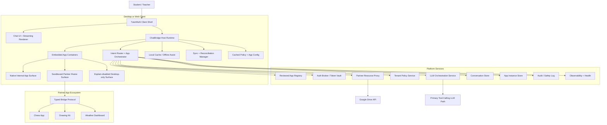
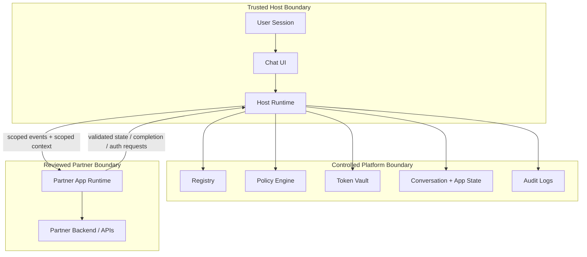
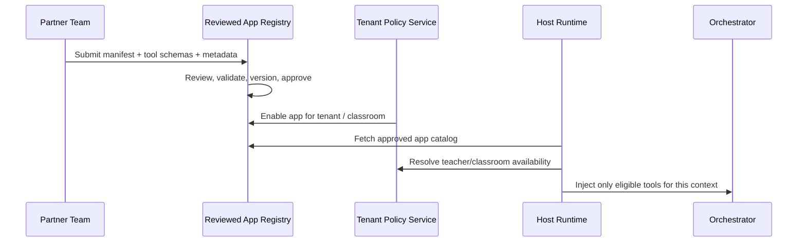
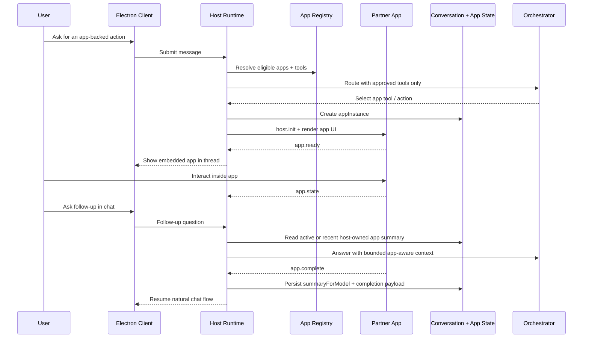
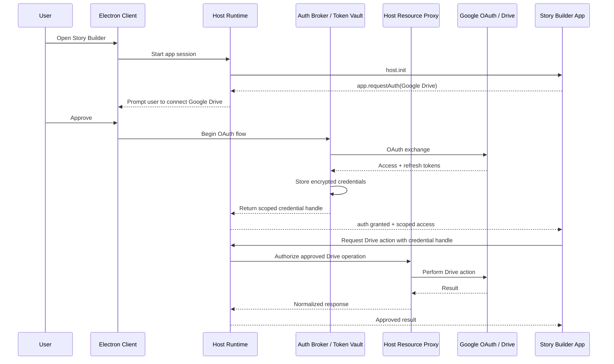
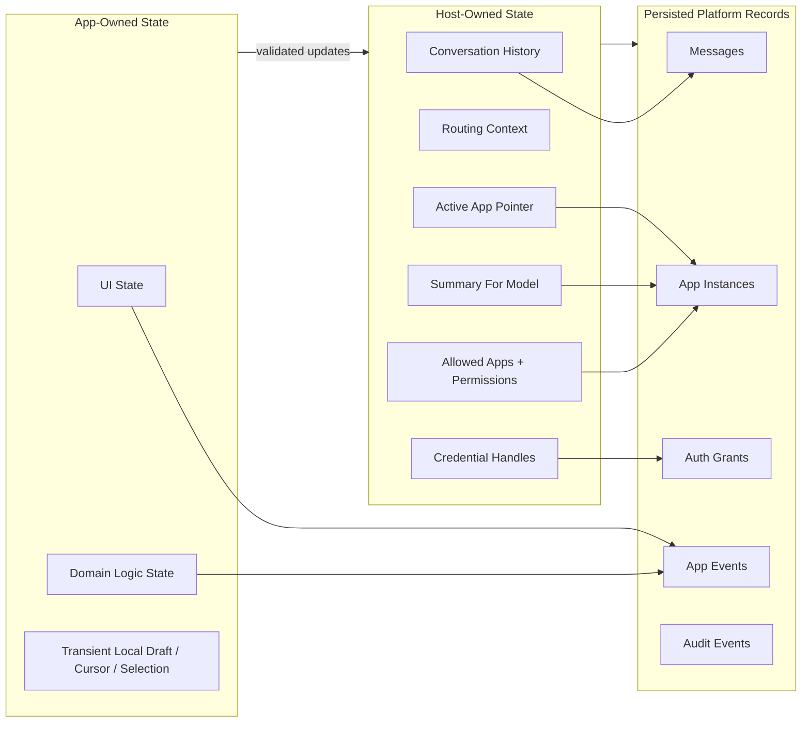
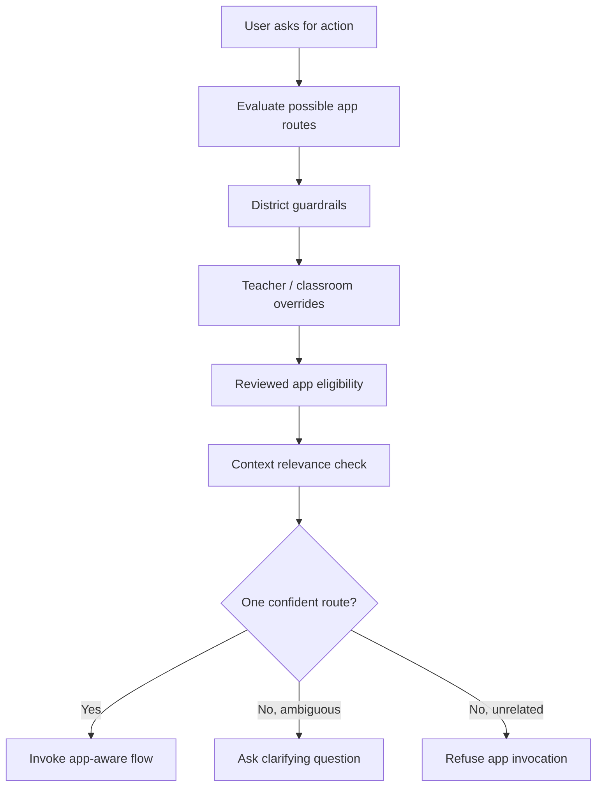

# ChatBridge Technical Architecture

This document is the technical companion to [PRESEARCH.md](./PRESEARCH.md). It is presentation-friendly by design and focuses on the runtime, trust boundaries, state ownership model, and the critical lifecycle that makes third-party applications feel native inside chat.

## 1. Architecture Goals

ChatBridge needs to satisfy four architectural goals at the same time:

- Keep the chat experience continuous while apps appear, update, and complete inside the thread.
- Preserve TutorMeAI's trust model for K-12 through reviewed partners, scoped permissions, and teacher-governed access.
- Support different classes of apps, including no-auth, public external, and authenticated partner experiences.
- Keep the checked-in client shell authoritative across both supported host runtimes: privileged desktop-electron and constrained web-browser.

## 2. System Overview

### Why this shape

- The client shell stays in charge of the user experience on both desktop and web.
- The host runtime becomes the policy and lifecycle brain of the app platform.
- Platform services own the parts that must be centralized: registry, policy, auth, persistence, auditability, and health.
- Partner apps remain isolated from both the raw desktop environment and the full conversation by default.
- Local cache exists for responsiveness, but the backend remains authoritative for durable state.

## 3. Supported Host Runtimes

ChatBridge now treats host runtime as an explicit contract rather than an implicit Electron-only assumption.

### Runtime targets

- `desktop-electron`
  - full privileged host runtime
  - may use native-shell or hosted-iframe reviewed app launch surfaces
  - remains the only runtime for Electron-bound auth broker, resource proxy, and manual smoke seams

- `web-browser`
  - no Electron IPC or main-process assumptions
  - may only launch reviewed apps that explicitly declare a web-safe surface
  - unsupported desktop-only features remain discoverable but must fail closed with an in-thread explanation

### Current reviewed app support matrix

- Chess: desktop-electron, web-browser
- Drawing Kit: desktop-electron, web-browser
- Weather Dashboard: desktop-electron, web-browser
- Story Builder: desktop-electron only
- Debate Arena: desktop-electron only legacy reference

### Runtime rule

If a reviewed app does not explicitly declare support for `web-browser`, the web host must not expose a launch tool or attempt a best-effort launch. The route should instead emit an explain-disabled app part that keeps the request in chat while telling the user that desktop is required.

## 4. Trust Boundaries

### Trust model

- The host is trusted to make routing, policy, and auth decisions.
- Platform services are trusted to persist and govern system state.
- Partner apps are reviewed, but still treated as less trusted than the host.
- Apps get scoped context and capabilities, not blanket access to the whole conversation or desktop runtime.

### Session binding rules

Bridge security should be tied to the app session, not just the app origin. Every app launch should create a `bridgeSession` with:

- `appInstanceId`
- expected origin
- protocol version
- launch-scoped opaque bridge token
- expiry timestamp
- capability list
- dedicated `MessagePort`
- monotonic message sequence

The host should send a signed bootstrap envelope plus a transferred `MessagePort`, require a nonce-based acknowledgment, and only accept subsequent messages on that bound port. Every state-changing event should also carry an idempotency key so replayed or duplicated events can be rejected safely.

## 5. Core Runtime Components

### Electron Client

- Renders the conversation UI
- Streams assistant responses
- Hosts native internal apps and sandboxed partner apps
- Maintains local caches for responsiveness
- Handles degraded-mode UX when network or app services fail

### ChatBridge Host Runtime

- Resolves app eligibility for the current user, tenant, teacher, and classroom
- Resolves app eligibility against the current host runtime before any reviewed app becomes invocable
- Routes user intent to chat-only behavior or app-aware behavior
- Injects allowed tool schemas into the orchestration path
- Tracks active app instances and summaries
- Selects the latest active or recent normalized app summary before later-turn
  model calls and fails closed when the latest app state is stale or missing a
  safe summary
- Validates all bridge traffic
- Converts app outcomes into durable chat memory
- Normalizes partner outputs before they become model-visible summaries
- Reduces active app state into bounded host-owned reasoning context before the
  model sees any position-specific prompt supplement

### Platform Services

- Reviewed app registry
- Tenant and classroom policy engine
- User auth and partner auth broker
- Conversation and app-instance persistence
- Audit logging and safety events
- App health and invocation telemetry

### App Runtime

- Native React-hosted apps for internal surfaces
- Sandboxed iframe apps for reviewed partners
- Explain-disabled shells for runtime-blocked reviewed apps
- Shared lifecycle contract no matter which rendering mode is used
- Chess now proves the native-hosted path by keeping a renderer-owned legal move
  engine behind the same host-owned app-part and reasoning-context contract
- The active flagship catalog is Chess, Drawing Kit, and Weather Dashboard.
  Debate Arena and Story Builder remain checked-in legacy reference
  implementations rather than active default-runtime targets.

### Sync and Reconciliation Manager

- Treats backend records as authoritative for conversations, app instances, and auth grants
- Tracks revision numbers or event offsets for durable objects
- Queues optimistic local actions with idempotency keys
- Replays only unacknowledged operations after reconnect
- Prevents stale local cache from overwriting committed server state

## 6. App Registration and Discovery

### Registration principles

- Partner apps do not self-register live in production without review.
- Tool schemas are validated and normalized by the host before any model sees them.
- Availability is decided per context, not globally.
- Runtime support is decided per host target, not inferred from a single legacy sandbox flag.
- App and host protocol versions must be checked before activation; mismatched versions should fail closed.

## 7. App Invocation Lifecycle

For the current Chess vertical slice, the "App" side of this sequence is a
native renderer component rather than an iframe partner. The important
architectural rule stays the same: the host-visible state is the bounded
`app.snapshot` payload, not opaque UI-local mutations.

### Key idea

The host, not the app, is responsible for translating app activity into conversational continuity.

### Tool execution semantics

The host should be the execution coordinator for app tools, even when the app owns the UI.

- All tool arguments are validated at invocation time against the reviewed schema version.
- Side-effecting invocations must carry idempotency keys.
- Retry behavior must be declared per tool as safe or unsafe.
- The host records normalized invocation payloads and results, not arbitrary raw partner blobs.
- Schema-version mismatches should fail closed with an explicit host error state rather than a best-effort execution attempt.

### Model-visible app context semantics

- App runtimes may emit detailed state, but the model only receives the
  host-owned subset that has been validated and normalized for the current
  turn.
- For Chess mid-game reasoning, the host reduces the board snapshot to bounded
  fields such as FEN, side to move, move count, status, and a short host note.
- If the latest board state is stale or cannot be validated, the host should
  inject an explicit degraded-state warning instead of pretending the assistant
  can still see the exact position.

## 7. Legacy Authentication Flow Reference for Story Builder

Story Builder is no longer part of the active flagship queue, but its
Google Drive auth flow remains the checked-in legacy reference for future
authenticated reviewed apps.

### Auth design principles

- The host owns credentials.
- The app never receives raw long-lived refresh tokens.
- Auth is part of the app lifecycle, not a detached settings flow.
- Authenticated partner apps should reach protected resources through host-mediated resource calls or an equivalent approved backend proxy.

## 8. State Ownership Model

### Ownership rule

Apps can propose state updates, but the host decides what becomes durable platform truth.

### Consistency rules

- Backend records are authoritative once acknowledged.
- Local cache may render pending state, but not commit lifecycle transitions by itself.
- Every durable update should include a revision or event offset.
- Reconnect logic should replay only operations without a backend acknowledgment.

### Memory normalization

Apps should not write directly into `summaryForModel`. Instead, they should emit structured completion payloads and optional suggested summaries, and the host should validate, redact, and normalize that information before it becomes model-visible memory.

The shared completion contract lives in `src/shared/chatbridge/completion.ts` and is intentionally app-agnostic:

- `status`: `success`, `interrupted`, or `failure`
- `outcome`: machine-readable `code`, optional `label`, and optional structured `data`
- `resumability`: optional hint about whether the app believes the work is resumable, restartable, or terminal
- `suggestedSummary`: optional app-authored hint that the host may later redact or ignore
- `error`: required only for `failure`, carrying structured code/message/details instead of freeform prose

The host event stream should persist the structured completion payload itself and keep `summaryForModel` host-authored only. App-originated events may suggest summaries, but they must not populate model-visible memory directly.

Later-turn prompt assembly should read only the latest host-owned app record and
inject one of three states into the model path:

- active summary when the newest live app instance has a normalized summary
- recent summary when the newest relevant app instance is completed and
  normalized
- unavailable fallback when the newest app state is stale, errored, cancelled,
  or missing a safe summary

## 9. Data Model Snapshot

The platform should persist these first-class records:

- `conversations`
- `messages`
- `app_registrations`
- `app_versions`
- `app_instances`
- `app_events`
- `tool_invocations`
- `user_app_auth_grants`
- `tenant_app_policies`
- `audit_events`

This separation is important because governance, troubleshooting, and lifecycle recovery are all much harder if chat and app concerns are collapsed into a single record shape.

Records that can produce side effects or state transitions should also carry idempotency and ordering metadata so the platform can recover safely after retries or reconnects.

## 10. Policy Evaluation Path

### Why this matters

Routing discipline is both a UX feature and a safety feature. A student should not be pushed into an app just because the model sees a vague opportunity.

### Policy precedence rules

- Reviewed registry status is a hard prerequisite for any app to be eligible.
- District-level denies are absolute and cannot be overridden below.
- Teacher and classroom controls may narrow, select, or disable from an approved set, but not enable an app outside district guardrails.
- When policy data is stale, the host should fail closed for new app activations and continue only already-authorized active sessions when safe.

## 11. Error Handling and Recovery

The host should treat these as explicit runtime states rather than generic failures:

- iframe load failure
- manifest mismatch
- invalid bridge event
- tool timeout
- auth denied
- expired partner credentials
- app crash
- completion payload missing

Recommended host responses:

- preserve the conversation,
- render a recoverable fallback surface,
- log the incident,
- and keep the chatbot able to explain what happened and what the user can do next.

## 12. Observability and Safety Operations

The architecture should make these events observable:

- app launch
- render success/failure
- tool invocation success/failure
- auth grant/revocation
- app completion
- policy refusal
- tenant disablement
- safety escalation

Operationally, the platform needs:

- per-app health dashboards,
- app-version kill switches,
- tenant-scoped disablement,
- and audit trails that help support and safety teams reconstruct what happened.

### Audit minimization rules

- Default logs should favor metadata, normalized payload shapes, and policy decisions over raw student content.
- Sensitive content should be redacted or hashed where possible.
- Exceptional forensic capture should be separately gated, explicitly time-bounded, and subject to retention policy.
- Auth logs should record grants, revocations, and resource classes accessed, not raw third-party credentials.

## 13. Presentation Talk Track

For a 3-5 minute architecture walkthrough, the simplest narrative is:

1. Start with the system overview diagram and explain the five layers.
2. Move to the trust-boundary diagram and explain why reviewed partner apps are still less trusted than the host.
3. Walk through the invocation lifecycle to show how chat stays aware of the app.
4. Show the legacy Story Builder auth sequence to explain how partner auth works without exposing credentials.
5. End on the state ownership model and say that this is the key design choice that keeps the experience coherent and safe.

## 14. Final Technical Position

ChatBridge should be implemented as an Electron-first host platform with:

- backend-supported governance and persistence,
- a reviewed partner registry,
- a typed bridge contract,
- host-owned memory and routing,
- sandboxed iframe support for partners,
- and explicit completion signaling as a first-class protocol event.

That architecture best fits the current repo, the K-12 trust model, and TutorMeAI's product strategy.
