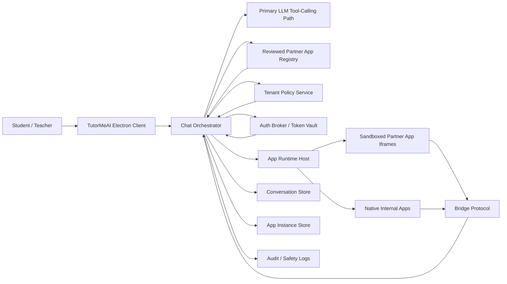
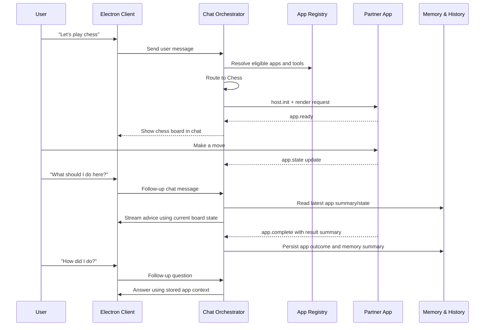

# ChatBridge Presearch

## Case Study Analysis

TutorMeAI is not trying to solve a generic chatbot problem. It is trying to solve a trust problem, a workflow problem, and a product differentiation problem at the same time. The case study makes that clear. The company already has scale in K-12, and its advantage is not the model itself. Its advantage is that teachers can shape the experience to fit real classrooms. ChatBridge matters because it extends that advantage from conversation into action. Instead of only answering questions, the system would let students enter guided activities such as chess, debate, or story creation without leaving the chat. That sounds simple on the surface, but it creates a much harder platform question: how do you let outside applications participate in the learning experience without losing safety, control, or continuity?

The biggest problem is the boundary between the chatbot and the application. If that boundary is weak, the experience breaks in obvious ways. The chatbot may lose track of what the student is doing. An app may finish work without the conversation understanding the outcome. A teacher may not know what tools are active in class. And a student may feel like they are being bounced between disconnected products instead of guided through one coherent experience. The platform therefore has to do more than embed app interfaces. It has to keep the conversation aware of what the app is doing, what stage the user is in, what happened when the task ended, and what follow-up help makes sense next.

The main trade-off is between flexibility and safety. A fully open marketplace would maximize variety, but it would also create the greatest risk for K-12 users. The more freedom an outside app has, the harder it becomes to guarantee appropriate content, consistent quality, data boundaries, and teacher oversight. The opposite extreme would be to keep everything fully internal, which would be safer in the short term but would limit TutorMeAI's ability to grow a meaningful ecosystem. The direction this presearch lands on is a middle path: reviewed partner apps first. That preserves extensibility, but only inside a governed model where origins, capabilities, and behaviors are known ahead of time.

The second major trade-off is between local speed and platform accountability. Because the current repo is Electron-based, it is tempting to keep everything inside the desktop app and move fast. But a real education platform cannot rely only on local state if it needs tenant policies, auditability, cross-session continuity, and secure authorization for partner apps. The decision here is to stay Electron-first as the user-facing shell while introducing backend services where the product clearly needs them. That keeps the team aligned with the current codebase without pretending that a local-only architecture is enough.

There were also ethical decisions embedded in the architecture. The first was to avoid broad default data sharing. Apps should not automatically see full student conversations just because they are embedded. The second was to preserve educator control. Districts need guardrails, but teachers and classrooms still need meaningful overrides because configurability is part of TutorMeAI's product identity. The third was to make safety operational, not rhetorical. Reviewed apps, kill switches, audit trails, and explicit completion contracts are all ethical choices because they determine how the platform behaves when something goes wrong.

Ultimately, the presearch lands on a clear recommendation: build ChatBridge as an Electron-first, reviewed-partner app platform with host-owned conversation state, strict app boundaries, explicit completion signaling, and teacher-governed access. The flagship app set should be Chess, Debate Arena, and Story Builder with Google Drive authentication. Together, they prove that TutorMeAI can move beyond configurable chat into trusted learning orchestration.

## Final Recommendation

ChatBridge should be built as a reviewed partner application platform inside TutorMeAI, with the existing Electron app as the primary client shell and backend services added for the platform capabilities the product now requires.

For the presentation-oriented technical view, see [ARCHITECTURE.md](./ARCHITECTURE.md).

The headline decisions are:

- Electron-first throughout
- Reviewed partner apps only in phase 1
- District guardrails with teacher and classroom overrides
- Hybrid app runtime
- Host-owned conversation and app lifecycle state
- Explicit completion signaling between app and chatbot
- Backend-authoritative state with client-side cache and replay semantics
- Launch-scoped bridge authentication for every app instance
- Story Builder as the authenticated flagship app, using Google Drive first

The recommended flagship app set is:

- Chess
- Debate Arena
- Story Builder

These three apps intentionally cover:

- long-lived game state,
- policy-sensitive educational workflow,
- and authenticated creative work with resumable state.

## Current Repo Audit

The current repo is a strong foundation, but not yet a finished partner platform.

### What the repo already gives us

- Structured sessions and message parts in `src/shared/types/session.ts`
- Tool-call rendering in `src/renderer/components/chat/Message.tsx` and `src/renderer/components/message-parts/ToolCallPartUI.tsx`
- Dynamic tool composition and streaming in `src/renderer/packages/model-calls/stream-text.ts`, `src/renderer/packages/mcp/controller.ts`, and `src/shared/models/abstract-ai-sdk.ts`
- An embedded rich-content surface in `src/renderer/components/Artifact.tsx`
- Context compaction and summary primitives in `src/renderer/packages/context-management/*`
- A pluggable provider registry in `src/shared/providers/index.ts` and `src/shared/providers/registry.ts`

### What still has to be built

- App manifests and a reviewed partner registry
- App instances and lifecycle records
- A typed host-app bridge contract
- Per-instance bridge authentication and replay protection
- Completion signaling as a first-class platform event
- Tenant policy and teacher override controls
- A host-managed partner auth broker
- Reconciliation rules between local cache and backend truth
- Host-side normalization of app outputs into model memory
- Durable app-aware memory that survives future turns cleanly

### What must be hardened

The current Electron posture is too permissive for a K-12 partner platform. The repo is good enough to prove interaction patterns, but it still needs stronger isolation, stricter origin handling, and a clearer split between local convenience state and server-owned platform state.

## Technical Architecture

The final system should be organized into five clear layers.

### 1. Electron Host

The desktop client remains the user-facing shell. It owns the chat UI, streaming presentation, embedded app containers, local caches, host bridge runtime, and graceful recovery behaviors when partner apps fail.

### 2. Platform Services

Backend services own user authentication, the reviewed app registry, tenant policy, teacher and classroom overrides, partner OAuth token brokerage, host-mediated resource access for authenticated partner apps, persistent conversation history, app instance records, audit logging, and operational telemetry.

### 3. Model Orchestrator

The host should maintain one primary app-aware orchestration path even if multiple LLM providers remain supported overall. Tool discovery, routing, app context injection, refusals, and post-completion memory should all be coordinated here.

### 4. App Runtime

The runtime should be hybrid:

- Native React-hosted apps for internal or tightly controlled experiences
- Sandboxed iframe apps for reviewed partner applications

Both should look identical to the orchestrator and follow the same lifecycle contract.

### 5. Policy and Audit Layer

Every app invocation should flow through policy checks and emit events that can be audited. This is not a nice-to-have in K-12; it is part of the product contract.

## Technical Architecture Diagram

## App Lifecycle Sequence

## Platform Contract

The platform contract should have two main artifacts.

### App Manifest

Each partner app should register a validated manifest containing:

- `appId`
- `name`
- `version`
- `origin`
- `uiEntry`
- `authMode`
- `permissions`
- `toolSchemas`
- `supportedEvents`
- `completionModes`
- `timeouts`
- `safetyMetadata`
- `tenantAvailability`
- `healthcheck`

### Bridge Protocol

The host and app should communicate through typed events with correlation IDs and explicit lifecycle semantics.

Core events should include:

- `host.init`
- `host.invokeTool`
- `host.syncContext`
- `host.resume`
- `host.cancel`
- `app.ready`
- `app.state`
- `app.complete`
- `app.error`
- `app.requestAuth`
- `app.telemetry`

### Bridge Session Security

The bridge cannot rely on plain `window.postMessage` plus origin checks alone. Every app launch should mint a launch-scoped `bridgeSession` that includes:

- `appInstanceId`
- expected app origin
- protocol version
- capability list
- expiration timestamp
- launch-scoped opaque bridge token
- a dedicated `MessagePort` for that specific iframe or native app session

The host should bootstrap the app with a signed initialization envelope, transfer a dedicated `MessagePort`, and require a nonce-based acknowledgment before the session becomes active. After that point, the host should only accept messages that arrive on the bound port, carry the expected `appInstanceId`, advance a monotonic sequence number, and include an idempotency key for state-changing events.

This design reduces spoofing risk from unrelated frames and makes replay or duplicate completion events rejectable at the host boundary.

### Tool Execution Contract

Tool invocation needs stronger rules than "the model calls a tool and the app handles it." For every app tool:

- execution authority must be explicit,
- arguments must be validated again at runtime by the host,
- side-effecting calls must include idempotency keys,
- retries must be opt-in and classified as safe or unsafe,
- schema compatibility must be versioned,
- and host logs must record the normalized invocation rather than untrusted raw payloads.

The default rule should be that the host is the authoritative execution coordinator even when the app owns UI state. If a schema mismatch or unsupported version is detected, the host should fail closed rather than attempting a best-effort call.

## State, Memory, and Routing

The host should own the canonical state model.

Conversation state should include:

- messages,
- active routing context,
- allowed apps for the current tenant and class,
- current active app instance,
- and model-facing summaries of prior app work.

Each app launch should create an `appInstance` with status, version, ownership, resumability, state snapshot, summary-for-model, and error fields.

The platform should also preserve an app event stream for initialization, render, tool use, state updates, completion, failure, cancellation, and resume. This is what lets the chatbot answer later questions about what happened in the app without depending on raw UI state.

### Authority and Reconciliation

The backend should be authoritative for:

- conversations,
- durable messages,
- app instances,
- app events,
- auth grants,
- and tenant policy.

The Electron client may cache and queue local work for responsiveness, but it should not become an alternate source of truth. Each durable record should carry a revision or event offset, each state-changing action should carry an idempotency key, and reconnect logic should replay only unacknowledged operations. Local optimistic state is acceptable for transient UI, but app lifecycle transitions and completion records should be considered committed only after backend acknowledgment.

### Memory Normalization

Apps should never write directly into model memory. Instead, they should submit structured outputs or suggested summaries that the host validates, redacts if needed, and converts into a normalized `summaryForModel`. This ensures that later chatbot turns depend on host-approved memory rather than raw partner-authored prose.

Routing rules should be conservative:

- Only route among reviewed and enabled apps
- Ask clarifying questions when ambiguity is real
- Refuse to invoke apps for unrelated prompts

## Authentication Strategy

The platform needs to support three categories of apps:

- Internal apps with no auth
- Public external apps with app-level credentials or no auth
- Authenticated partner apps with user authorization

Story Builder should be the first authenticated app and should use Google Drive first. The host should initiate auth, store and refresh credentials, and hand apps scoped access or credential handles rather than long-lived raw tokens.

For the data plane, Story Builder should not call Google Drive with a raw user token from inside the iframe. Instead, the app should call a host-mediated resource layer or partner backend using a scoped credential handle. The host or backend service then performs the Drive action, logs it appropriately, and returns the approved result to the app.

## Security and Ethics

Security is part of the user experience, not separate from it.

The platform should enforce:

- reviewed partner apps only in phase 1,
- strict origin allowlists,
- minimal iframe sandbox permissions,
- no automatic access to full conversation history,
- capability-scoped context sharing,
- tenant kill switches,
- and audit trails for app launches, completions, auth grants, and important safety-relevant outputs.

The key ethical stance is that apps should receive only the minimum context required to help the user. Teacher control and tenant governance are not just enterprise features here; they are part of what makes the platform appropriate for students.

Auditability should not become surveillance by accident. The default logging mode should capture metadata, policy decisions, and normalized event envelopes, not raw student content. If exceptional forensic capture is ever needed, it should be separately gated, redacted by default, and governed by explicit retention rules.

## Required App Designs

### Chess

Chess proves long-lived, bidirectional state. It needs a legal move engine, visible board UI, invalid move handling, mid-game analysis, and an explicit end-of-game completion summary that the chatbot can discuss afterward.

### Debate Arena

Debate Arena proves structured educational workflow. It needs topic and stance setup, turn-based argument flow, rubric-aware guidance, teacher-configurable moderation or difficulty controls, and a final performance summary that the chatbot can continue discussing.

### Story Builder

Story Builder proves authenticated partner workflows. It needs Google Drive auth, project save and resume, draft-aware chatbot assistance, export or persistence of final work, and a completion event that turns the app outcome back into chat context.

## Build Strategy

Even though this presearch targets the final system rather than a toy MVP, the implementation should still move vertically.

Recommended sequence:

1. Reliable chat and persistent history
2. App manifest, bridge security, and tool execution contract
3. One fully integrated flagship app
4. Completion signaling and app-aware context retention
5. Multiple apps and routing rules
6. Authenticated app support
7. Policy controls, safety hardening, and partner docs

That ordering keeps the hardest architectural risks early: lifecycle ownership, context continuity, and completion semantics.

## Risks to Watch

- Treating UI embedding as the hard part instead of state and trust
- Letting partner apps own too much conversation context
- Leaving completion signaling vague or implied
- Underbuilding teacher and classroom controls
- Taking shortcuts with partner auth token ownership

## Appendix A: Planning Checklist

1. **Scale & Load Profile**: Plan for high and spiky school-hour usage, not smooth consumer traffic. The rationale is that TutorMeAI already has meaningful K-12 reach, so the app platform has to survive classroom bursts from the start.

2. **Budget & Cost Ceiling**: Do not optimize around an arbitrary hard ceiling yet; optimize around guardrails, quotas, and observability. The rationale is that cost discipline matters, but premature austerity would likely distort core architecture choices more than help them.

3. **Time to Ship**: Design the final platform now, but implement it vertically to reduce risk. The rationale is that the hardest failures here come from weak contracts and state handling, not from lack of surface-level features.

4. **Security & Sandboxing**: Use reviewed partner apps, strict origin controls, scoped context sharing, and explicit kill switches. The rationale is that K-12 trust breaks quickly if app boundaries are vague or if unsafe content can slip through an overly open ecosystem.

5. **Team & Skill Constraints**: Stay TypeScript/React/Electron-first and hide complexity behind internal SDKs. The rationale is that moving fast on a known stack is more valuable than chasing theoretical purity on a new one.

6. **Plugin Architecture**: Use a hybrid runtime with validated manifests and a typed bridge protocol. The rationale is that this preserves long-term extensibility without forcing every app through the exact same rendering strategy.

7. **LLM & Function Calling**: Choose one primary orchestration path for app workflows and validate tool schemas before injection. The rationale is that platform correctness matters more than maximizing provider symmetry on day one.

8. **Real-Time Communication**: Keep chat streaming separate from app-host messaging. The rationale is that model streaming and app state updates have different failure modes and should not be coupled into one transport.

9. **State Management**: The host owns conversation and app lifecycle state; apps own only their internal UI state. The rationale is that the chatbot cannot remain reliable if truth is scattered across untrusted app surfaces.

10. **Authentication Architecture**: Keep platform auth separate from app auth and make the host the credential owner, with partner APIs accessed through scoped handles or host-mediated resource calls. The rationale is that OAuth flows become much safer and easier to govern when apps never hold long-lived credentials directly.

11. **Database & Persistence**: Store conversations, app registrations, app instances, auth grants, policy, and audit events as separate records, with revisions and idempotency keys for reconciliation. The rationale is that governance and recovery become much harder when chat and app concerns are merged into one blob and client caches can drift.

12. **Security & Sandboxing Deep Dive**: Default to deny, minimize iframe permissions, and validate every bridge event against a launch-scoped session, expected origin, and monotonic sequence. The rationale is that small trust boundary mistakes compound quickly when student-facing partner apps are involved.

13. **Error Handling & Resilience**: Treat load failures, auth failures, bad tool calls, and timeouts as recoverable host states. The rationale is that the conversation should remain usable even when an app is degraded.

14. **Testing Strategy**: Test the host contract independently, use mock apps, and verify full lifecycles end to end. The rationale is that most breakage will happen at the seams between chat, host, and app rather than inside isolated components.

15. **Developer Experience**: Provide a manifest spec, bridge SDK, local harness, validator, and debugging tools. The rationale is that partner quality will depend heavily on how easy it is to build against the platform correctly.

16. **Deployment & Operations**: Version apps independently, monitor health and failures, and support safe rollback. The rationale is that app updates cannot be allowed to silently break active classroom workflows.

17. **Tenant Policy & Teacher Controls**: Use district guardrails with teacher and classroom overrides, but make district denies absolute and let lower scopes only narrow or select within approved sets. The rationale is that TutorMeAI's core product strength is configurability, and ChatBridge should amplify rather than flatten that advantage without weakening governance.

18. **Auditability & Safety Operations**: Log app launches, completions, auth grants, tool invocations, and safety-relevant outputs with redaction and retention rules that minimize raw student content by default. The rationale is that reviewed partner apps still need operational accountability once they are in front of students, but that accountability must not quietly expand into unnecessary data capture.
